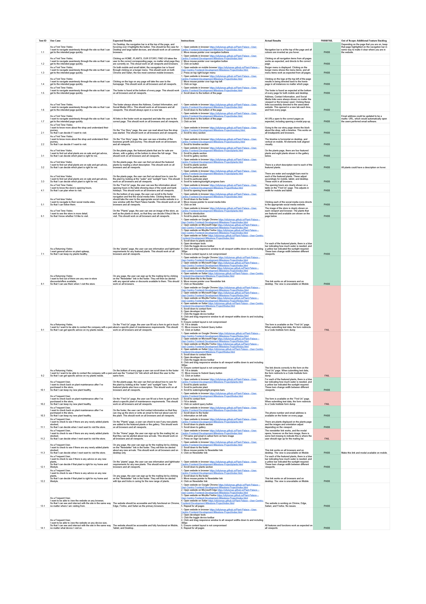

<h1 align="center">User Centric Frontend Development Milestone Project (Milestone Project #1)</h1>
<h1 align="center">Olly Lomax</h1>

<h2 align="center"></h2>

# Plant Palace Website
I made this website using my knowledge of HTML5, CSS3, jQuery and Bootstrap frameworks and UX Design which I have learned from Code Institute during my Diploma in Full Stack Software Development. The shop was made up by myself with the intention of completing my User Centric Frontend Development Milestone Project. I went slightly out of scope for the project in order to learn as much as I possibly could during the development process. From scope to testing has taken me just under 10 days.

View the live project [here](https://ollylomax.github.io/Plant-Palace---User-Centric-Frontend-Development-Milestone-Project/index.html).

The owners of Plant Palace wanted a fully responsive website with the purpose of showcasing their collection of house plants on sale, providing information and advice about the more popular species of house plants and giving a personal background on their journey and experiences. They wish to garner interest from users to both visit their local store and sign up to their mailing list.

## User Experience (UX)

-   ### User Stories

    -   #### First Time Visitor Goals

        - As a First Time Visitor, I want to navigate seamlessly through the site so that I can get to the intended page quickly.

        - As a First Time Visitor, I want to know more about the shop and understand their journey so that I can decide if I want to visit.

        - As a First Time Visitor, I want to find out what plants are on sale and get advice so that I can decide which plant is right for me.

        - As a First Time Visitor, I want to know the store’s opening hours so that I can plan when to visit.

        - As a First Time Visitor, I want to navigate to their social media sites so that I can follow them.

        - As a First Time Visitor, I want to see the store in more detail so that I know whether I’d like to visit.

    -   #### Returning Visitor Goals

        - As a Returning Visitor, I want general advice on plant upkeep so that I can keep my plants healthy.

        - As a Returning Visitor, I want to find out if there are any new in-store discounts/offers available so that I can use them when I visit the store.

        - As a Returning Visitor, I want to be able to contact the company with a personal query, so that I can get specific advice on my plants needs.

    -   #### Frequent User Goals

        - As a Frequent User, I want to check back on plant maintenance after I’ve purchased in the store, so that I can keep my new plant healthy.
        
        - As a Frequent User, I want to check to see if there are any newly added plants stocked so that I can decide when I next want to visit the store.

        - As a Frequent User, I want to check to see if there is any advice on any new plants so that I can decide if that plant is right for my home and lifestyle.

        - As a Frequent User, I want to be able to view the website on any browser so that I can see and interract with the site in the same way no matter where I am visiting from.

        - As a Frequent User, I want to be able to view the website on any device size so that I can see and interract with the site in the same way no matter what device I visit on.

-   ### Structure
    **As a First Time Visitor, I want to navigate seamlessly through the site so that I can get to the intended page quickly.**

    At the top of every page there will be a navigation bar. This will include:
    - **Plant Palace Logo** which will link back to the home page(index.html) when clicked on.
    - **Home** button which will link to the 'Home' page(index.html) when clicked on.
    - **Plants** button which will link to the 'Plants' page(plants.html) when clicked on.
    - **Our Story** button which will link to the 'Our Story' page(ourstory.html) when clicked on.
    - **Find Us** button which will link to the 'Find Us' page(findus.html) when clicked on.

    At the bottom of every page there will be a consistent footer. This will include:
     - Information block containing Plant Palace Address, Phone Number and Email Address.
     - Anchor links:
       - **Newsletter** which opens a modal window for mailing list sign up when clicked on.
       - **About Us** which directs the user to the 'Our Story' page(ourstory.html) when clicked on.
       - **Contact Us** which directs the user to the specific part of the 'Find Us' page containing the form.
     - Social media block containing:
       - **Facebook** link which will open a new window for the user when clicked on.
       - **Twitter** link which will open a new window for the user when clicked on.
       - **Instagram** link which will open a new window for the user when clicked on.
       - **YouTube** link which will open a new window for the user when clicked on.
       - **Pinterest** link which will open a new window for the user when clicked on.

    If the user attempts to type the website in manually and makes a spelling error, then they are taken to a specific error 404 page(404.html) with clear direction back to the home page.

    The **Hero image** will be the first section of the Home page. This will contain:
     - Large background image of staff member kneeling down over stock plants.
     - Title box containing h1 heading describing exactly what the purpose of the website is.
     - Callout form offering 10% discount in store for signing up to the mailing list.

    The **Introduction** section will be the second section of the Home page. This will contain:
     - Background image of plant.
     - Short introduction about the company.

    A small **Plants** section will be the final section of the Home page. This will contain:
     - Image of two plants.
     - Short teaser description for each plant.
     - Buttons directing to the more detailed descriptions and advice on Plants page.

-   ### Design

    - #### Colour Scheme

        
        
        

        I used three main colours for the website. A **green** for the main theme, a **dark green** for borders and smaller elements and an **off-white** for a clean contrast against both. I felt like they complimented each other well, related well to the house plant theme and provided the necessary contrast to use almost exclusively throughout the design process.

    - #### Typography

        I used two main fonts for the website, **Titillium** and **Roboto** which are both well recognised and a standard in web design.

    - #### Imagery

        I designed a simple logo with CSS styling which is present in the navigation of each page. There are an array of plant images across the site taken from [Unsplash](https://unsplash.com/) which is a free resource for stock images. They have been selected with as much uniformity as possible. There are also images relating to the journey and location of the imaginary owners, the interior and exterior of the imaginary shop as well as portrait images pertaining to fake user reviews.

-   ### Wireframes

    - Home
    
    - Plants
    
    - Our Story
    
    - Find Us
    

    The individual wireframes for each page are available in pdf format below.

    **Mobile** 
    [Plant Palace - Home](docs/wireframes/plantpalace_home-mob.pdf)

    [Plant Palace - Plants](docs/wireframes/plantpalace_plants-mob.pdf)

    [Plant Palace - Our Story](docs/wireframes/plantpalace_ourstory-mob.pdf)

    [Plant Palace - Find Us](docs/wireframes/plantpalace_findus-mob.pdf)

    **Desktop** 
    [Plant Palace - Home](docs/wireframes/plantpalace_home.pdf)

    [Plant Palace - Plants](docs/wireframes/plantpalace_plants.pdf)

    [Plant Palace - Our Story](docs/wireframes/plantpalace_ourstory.pdf)

    [Plant Palace - Find Us](docs/wireframes/plantpalace_findus.pdf)

-   ### Notable amendments to Design

    - All Pages
        - Removed footer anchors for Newsletter, About Us and Contact us on Mobile devices.
        - Modal form added to Newsletter anchor on Desktop footer.
    - Home
        - Image in second section of Home page changed to plant background picture. (Mobile and Desktop)
        - Callout form on Mobile Home Page moved to overlay hero image as per Desktop.
    - Plants
        - Image in first section of Plants page changed to shop exterior instead of interior. (Mobile and Desktop)
        - Moved Quotes section from Our Story page to below first section on Plants page. (Mobile and Desktop)
        - Added Gallery section below Plants section on Plants page. (Mobile and Desktop)
    - Our Story
        - Removed Hero image and Quotes section and replaced with Timeline section with visual timeline. (Mobile and Desktop)
    - Find Us
        - Added Opening hours section with table below Map section of Find Us page. (Mobile and Desktop)

-   ### Functional Limitations
    Having not begun JavaScript on the course yet, all form actions on the site are directed to a Code Institute form dump I used during the learning process. Therefore no data is stored from POST method on form submission.

## Features

-   ### Current
    - All pages
        - Responsive across all viewports by use of my own media queries aswell as bootstrap classes.
        - Clear desktop navigation header with collapsable menu on mobile for space saving.
        - Newsletter anchor link on footer bringing up modal form with discount offered.
        - Contact us anchor link on footer directly linking to form position on find us page.

    - Home
        - Callout form on hero image with discount offered in store.
        - Buttons on small plants section on home page directly linking to applicable plant on plants page.

    - Plants
        - Small gallery of plants at the bottom of the plant section.
    
    - Find Us
        - Interactive google maps iframe on find us page (exact location not specified as shop is imaginary).
        - Contact form with three category headings for query submission.

-   ### Prospective
    - All pages
        - Implementation of a Live Help facility to ensure customers have as many ways possible to contact the store for advice pre or post-purchase.
    - Plants
        - Expand gallery extensively with pagination.
        - Add a search box with filters and sortation.
    - Our Story
        - Embed video/s of owners with introduction to themselves and their company.

## Technologies Used

-   ### Languages
    - [HTML5](https://en.wikipedia.org/wiki/HTML5) 
        The language used to display content and provide structure.
    - [CSS3](https://en.wikipedia.org/wiki/Cascading_Style_Sheets) 
        I used heavy custom styling on top of Bootstrap frameworks.

-   ### Frameworks, Libraries & Programs
    - [Bootstrap v4.6](https://getbootstrap.com/docs/4.6/getting-started/introduction/) 
        Framework used throughout the site to provide baseline styling and import JavaScript/jQuery.
    - [Google Fonts](https://fonts.google.com/) 
        Used to import the two fonts used throughout the website: Titillium and Roboto.
    - [Font Awesome](https://fontawesome.com/) 
        Used for icons which I added to various sections of the website including Nav, Footer and Timeline for visual aid and user experience.
    - [jQuery](https://jquery.com/) 
        Used for modal form pop-up from Newsletter anchor on footer.
    - [Git](https://git-scm.com/) 
        Used for version control to commit and push code via Gitpod to the GitHub repository where the source code is stored.
    - [Gitpod](https://www.gitpod.io/) 
        This is the IDE (Integrated Development Environment) I used to build the website and commit to Git and push to GitHub
    - [GitHub](https://github.com/) 
        GitHub is used to store the projects code after being pushed from Git and to host the deployment of the live site via GitHub Pages.
    - [Adobe Photohop](https://www.adobe.com/uk/products/photoshop.html) 
        Used to convert and resize images before uploading to local repositry.
    - [Adobe Illustrator](https://www.adobe.com/uk/products/illustrator.html) 
        Used to edit logo and export documents before uploading to local repositry.
    - [Balsamiq](https://balsamiq.com/) 
        Used during the scoping process to visualise the basic structure of the website and create wireframes during the Skeleton phase of UX Design.

-   ### Resources, Tools & Diagnostics
    - [Unsplash](https://unsplash.com/) 
        Stock photo database used as my main source of imagery throughout the website.
    - [TinyJPG](https://tinyjpg.com) 
        Used to downsample images to smaller file sizes in order to increase load times and reduce storage requirements.
    - [cloudconvert](https://cloudconvert.com) 
        Used to convert hero image for mobile to the smallest file size possible to reduce data usage on mobile devices.
    - [Favicon.io](https://favicon.io/) 
        Used in the creation of the website Favicon across all pages.
    - [Chrome DevTools](https://developer.chrome.com/docs/devtools/) 
        Used  throughout the design process to temporarily manipulate styling for debugging purposes.
    - [Safari Web Inspector](https://developer.apple.com/safari/tools/) 
        Used as above for cross-browser support.
    - [Firefox Developer Tools](https://developer.mozilla.org/en-US/docs/Tools) 
        Used as above for cross-browser support.
    - [Am I Responsive?](http://ami.responsivedesign.is/) 
        Used to create a website mock-up image across different sized devices to showcase viewport responsiveness.
    - [WAVE](https://wave.webaim.org/) 
        Used for diagnostic contrast testing.
    - [Lighthouse](https://developers.google.com/web/tools/lighthouse) 
        Used for diagnostic performance, accessibility and SEO testing.
    - [W3C Markup Validation Service](https://validator.w3.org/) 
        HTML Validator used to validate every page of the project to ensure there were no syntax errors.
    - [W3C CSS Validation Service](https://jigsaw.w3.org/css-validator/) 
        CSS Validator used to ensure there were no syntax errors in styling.

## Testing
The W3C Markup Validator and W3C CSS Validator Services were used to validate every page of the project to ensure there were no syntax errors. Both returned **no errors** for every page.

WAVE was used for contrast testing and returned **no contrast errors** for every page.

Lighthouse was used for performance, accessibility and SEO testing and returned scores of **90-100** for every page.

I ran the website locally and tested on the deployed version. No differences found.

- ## Test Strategy
The testing will be performed only on the aesthetics, visual effects and layout of the website as any back-end functionality is out of scope for this project.

- This will be done on four web browsers:-
  - Chrome
  - Firefox
  - Safari
  - Brave

 - And on every common breakpoint (Mobile, Tablet, Desktop, XL Desktop).

 Validation of feature inclusion will be undertaken from the wireframes scoped during the Skeleton stage of UX design.
 
 Elements should not overlap other container divs and should remain on the screen at all sizes above and including 300px.

 All nav links should direct to the intended pages applicable to their names (with the exception of the Home page directing to index.html).

 Form validation will be undertaken to ensure the correct inputs are posted and that all fields are required. This will be done with Code Institute's form dump which I used during the learning modules.

 Social media links should open in new browser windows.

The live project is deployed [here](https://ollylomax.github.io/Plant-Palace---User-Centric-Frontend-Development-Milestone-Project/index.html).

- ## Testing User Stories from User Experience (UX) Section

    - ### First Time Visitor Goals
        - **As a First Time Visitor, I want to navigate seamlessly through the site so that I can get to the intended page quickly.** 
            - On Desktop, the navigation bar is at the top of the page, and hovering over it highlights the button. This should be the case for Desktop and large tablet devices, and should work on all common browsers.
            
            - Clicking on HOME, PLANTS, OUR STORY, FIND US takes the user to the corresponding page, no matter what page they are currently on.

            - On both mobile and small tablet, the navagation bar is found by clicking on a burger menu. This should work on both Chrome and Safari, the two most common mobile browsers.

            - Clicking on the logo on any page will take the user to the homepage.

            - The footer is found at the bottom of every page.

            - The footer always shows the Address, Contact Information, and Social Media URLs which should always open in new windows.

            - On Desktop and large tablet, all links in the footer should work as expected and take the user to the correct page.

        - **As a First Time Visitor, I want to know more about the shop and understand their journey so that I can decide if I want to visit.** 
            - On the "Our Story" page, the user can read about how the shop was started.

            - On the "Our Story" page, the user can see a timeline of the business growth and journey.

        - **As a First time Visitor, I want to find out what plants are on sale and get advice so that I can decide which plant is right for me.** 
            - On the "Plants" page, the featured plants that are for sale are shown, with a gallery at the bottom to show the full range.
            - On the "Plants" page, the user can find out about the featured plants by reading a short description.
            - On the "Plants" page, the user can find out about how to care for the plant by looking at the "watering" and "sunlight" bars. 

        - **As a First Time Visitor, I want to know the store’s opening hours so that I can plan when to visit.** 
            - On the "Find Us" page, the user can see the information about opening hours in the table showing days of the week and bank holidays. This should work on all browsers and all viewports.

        - **As a First time Visitor, I want to navigate to their social media sites so that I can follow them.** 
            - On the bottom of any page, the user can scroll to the footer navigation and find the social media links. Clicking these links should take the user to the appropriate social media website in a new window with the Plant Palace handle. This should work on all browsers and all viewports. 

        - **As a First Time Visitor, I want to see the store in more detail so that I know whether I’d like to visit.** 
            - On the "Plants" page, the user can see an image of the store, as well as the plants in stock, so that they can decide if they'd like to visit. This should work on all browsers and all viewports.

    - ### Returning Visitor Goals

        - **As a Returning Visitor, I want general advice on plant upkeep so that I can keep my plants healthy.** 
        Plant maintenance advice is clearly provided on the Plants page for many species of house plant. Progress bars are also displayed for aesthetics and to improve the user experience representing how much or how little each plant needs sunlight and watering.
            - On the "Plants" page, the user can see information and light/water requirements for any featured plants.

        - **As a Returning Visitor, I want to find out if there are any new in-store discounts/offers available so that I can use them when I visit the store.** 
            - On any page, the user can sign up for the mailing list by clicking on the "Newsletter" link in the footer. They will then be alerted with any special sales or discounts available to them. This should work on all browsers

        - **As a Returning Visitor, I want to be able to contact the company with a personal query, so that I can get specific advice on my plants needs.** 
            - On the "Find Us" page, the user can fill out a form to get in touch about a specific plant's maintenance requirements.
            - On the bottom of every page a user can scroll down to the footer and use the "Contact Us" link which will direct the user to the same form.

    - ### Frequent User Goals

        - **As a Frequent User, I want to check back on plant maintenance after I’ve purchased in the store, so that I can keep my new plant healthy.** 

            - On the plants page, the user can find out about how to care for the plant by looking at the "watering" and "sunlight" bars. The featured plants also have a description.

            - On the "Find Us" page, the user can fill out a form to get in touch about a specific plant's maintenance requirements.

            - On the footer, the user can find contact information so that they can ring up the store or write an email to find out about care for the plant.
    
        - **As a Frequent User, I want to check to see if there are any newly added plants stocked so that I can decide when I next want to visit the store.** 

            - On the "Plants" page, a user can check to see if any new plants are added to the featured plants or the gallery.

            - On the "Home" page, the user can sign up for the mailing list, so that they can be alerted about new arrivals.

            - On any page, the user can sign up for the mailing list by clicking on the "Newsletter" link in the footer. They will then be alerted about any new arrivals.

        - **As a Frequent User, I want to check to see if there is any advice on any new plants so that I can decide if that plant is right for my home and lifestyle.** 
        
            - On the "Plants" page, the user can see information and light/water requirements for any new plants.

            - On any page, the user can sign up for the mailing list by clicking on the "Newsletter" link in the footer. They will then be alerted with tips and tricks in caring for the new range of plants.

        - **As a Frequent User, I want to be able to view the website on any browser so that I can see and interract with the site in the same way no matter where I am visiting from.** 
            - The website should be accessible and fully functional on Chrome, Edge, Firefox, and Safari as the primary browsers.

        - **As a Frequent User, I want to be able to view the website on any device size so that I can see and interract with the site in the same way no matter what device I visit on.** 
            - The website should be accessible and fully functional on Mobile, Tablet, and Desktop.

- ## Test Results

    Test results can be found below.

    Link directly to the Google Sheet [here](https://docs.google.com/spreadsheets/d/1aIn2dqtc6cXVij5FZhDcnQ3f86FkiUTQiTZKeaS8SFc).

    Downloadable .pdf format [here](docs/readmepics/Plant-Palace_Test-Case-Scenarios.pdf).

    Downloadable .xlsx format [here](docs/readmepics/Plant-Palace_Test-Case-Scenarios.xlsx).

- ## Test Fails and Resolutions

  - ### 9.1 FAIL - Out of scope
    Testing the POST and storage of any data submitted in the form
  - ### 9.2 FAIL - Out of scope
    Testing the POST and storage of any data submitted in the form
  - ### 10.2 FAIL - Out of scope
    Testing the POST and storage of any data submitted in the form
  - ### 11.2 FAIL - Text for  mailing list sign up absent
    Added and committed.
    
- ## Undocumented Changes
  - Plants on Home page were not linking directly to the relevant plants on Plants page. 
    Added and committed.
  - Hero image inconsistency on mobile. 
    Added and committed.

## Deployment

 - ### Project Creation
    I created this project by first installing the Gitpod [plugin](https://www.gitpod.io/). I then navigated to the Code Institute [gitpod-full-template](https://github.com/Code-Institute-Org/gitpod-full-template) and clicked on the "Use this Template" button. I chose and input my project name (Plant-Palace---User-Centric-Frontend-Development-Milestone-Project) then created my repositry from the template by clicking the button. After that I simply clicked on the "Gitpod" button from my repositry page to open up my IDE and begin coding.

The following commands were used throughout the development process:

- **git status** 
 Used to show my untracked and staged files.
- **git add** 
 Used to add files to the staging area before commiting.
- **git commit -m** 
 Used to commit the changes to my local repository.
- **git push** 
 Used to push all commited changes to the GitHub repository.
- **git log** 
 Used to show a list of my previous commits.
- **git reset --hard** 
 Used with applicable checksum to revert to a previous commit.

 - ### GitHub Pages
   To host the website I used GitHub Pages. This was done using the following process:

    - Navigate to my [GitHub Repository](https://github.com/ollylomax/Plant-Palace---User-Centric-Frontend-Development-Milestone-Project)
    - Click on the 'Settings' Tab.
    - Scroll Down to and click on the 'Pages' heading on the left side of the page.
    - Select 'Master Branch' as the source.
    - Click the 'Save' button.
    - Click on the [link](https://ollylomax.github.io/Plant-Palace---User-Centric-Frontend-Development-Milestone-Project) to go to the live deployed page.

 - ### Run Locally
   In order to run a local version of the website I used the following steps:

   - Navigate to my [GitHub Repository](https://github.com/ollylomax/Plant-Palace---User-Centric-Frontend-Development-Milestone-Project)
    - Click the 'Code' button for a drop down menu.
    - Download and unpack the ZIP file then and open with the IDE you prefer.
    #### OR
    - Navigate to my [GitHub Repository](https://github.com/ollylomax/Plant-Palace---User-Centric-Frontend-Development-Milestone-Project)
    - Click the 'Code' button for a drop down menu.- Copy Git URL from the HTTPS dialogue box.
    - Open the IDE you prefer then open a terminal window in a directory of your choice.
    - Use the **git clone** command in the terminal followed by the copied git URL.
    - A clone of the project will be created locally on your machine.

## Credits
 - ### Code

   Bootstrap 4.6 was used throughout the project to assist in making site responsive using the Bootstrap Grid System.

   I referenced a code snippet from Bootdey https://www.bootdey.com/snippets/view/simple-horizontal-timeline before building the timeline on the 'Our Story' page.

 - ### Content
   Plant description content and description of the city of York are sourced from [Wikipedia](https://en.wikipedia.org/wiki/Main_Page). 
   All other content on this site was created by Olly Lomax.

 - ### Media

   All images on this site were sourced from free stock images on [Unsplash](https://unsplash.com/).

 - ### Acknowledgements

    Many thanks to my Code Institute Mentor Daisy McGirr for her insight and advice during development.