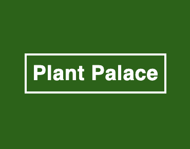
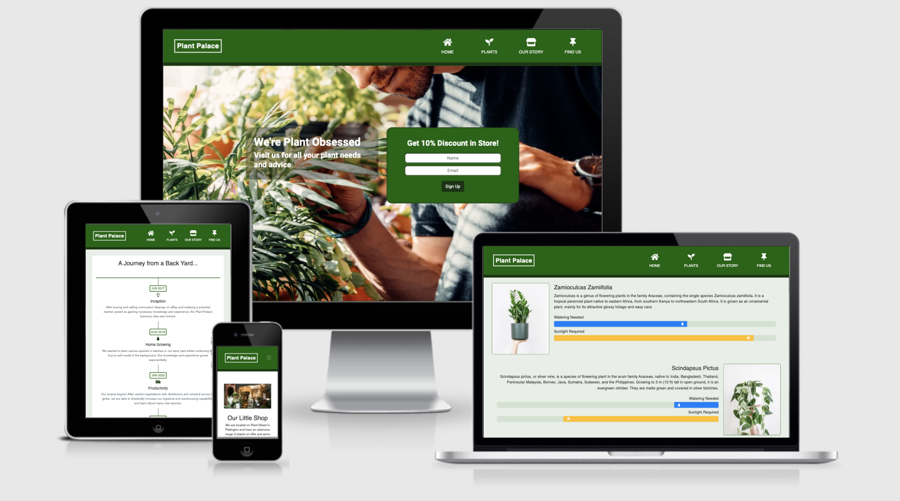
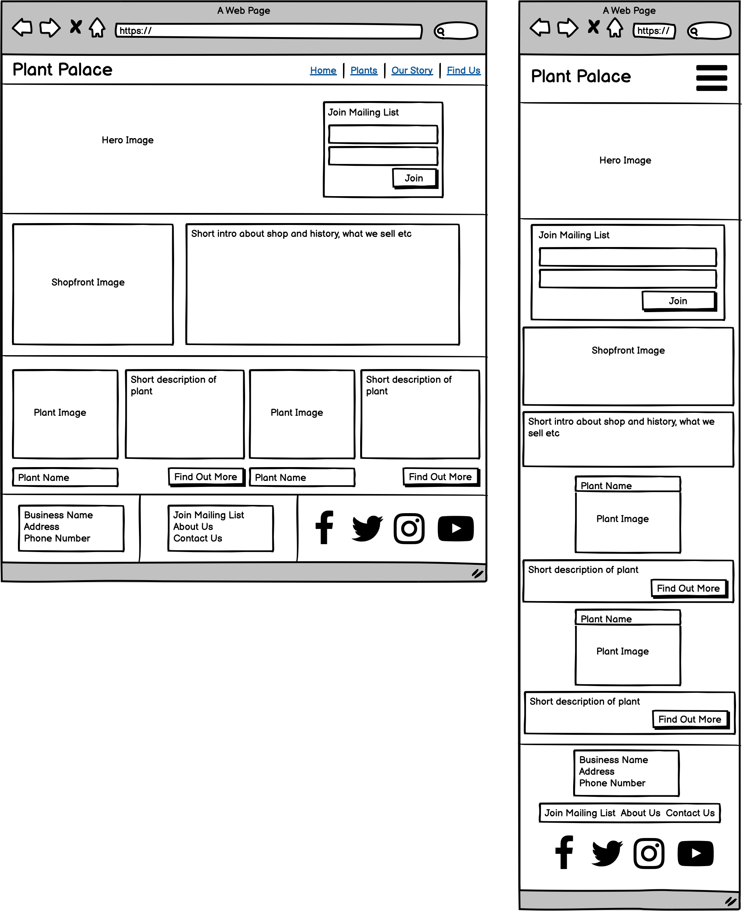
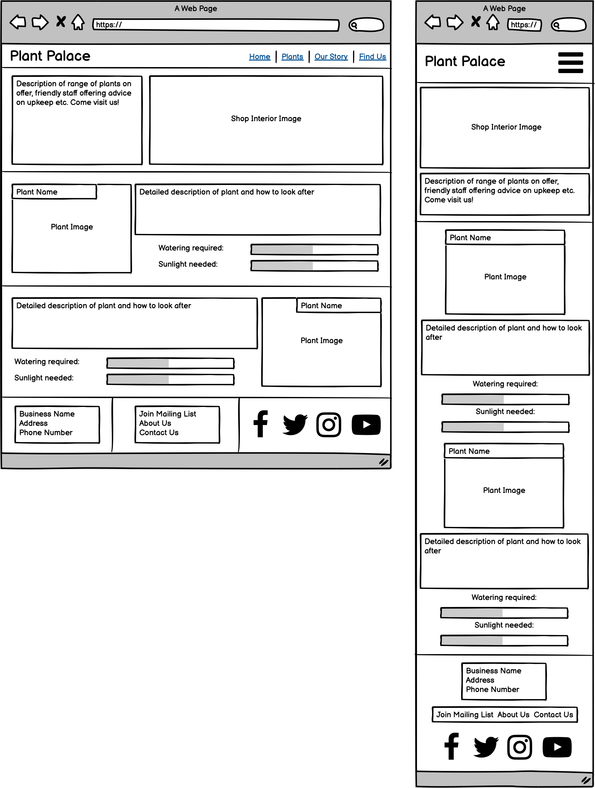
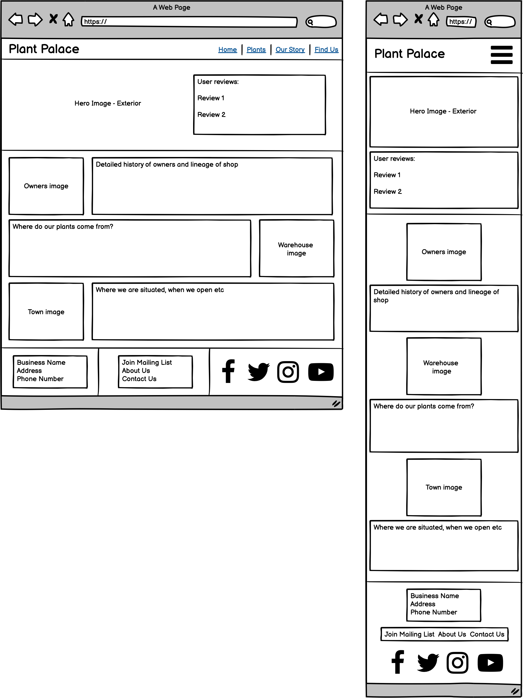
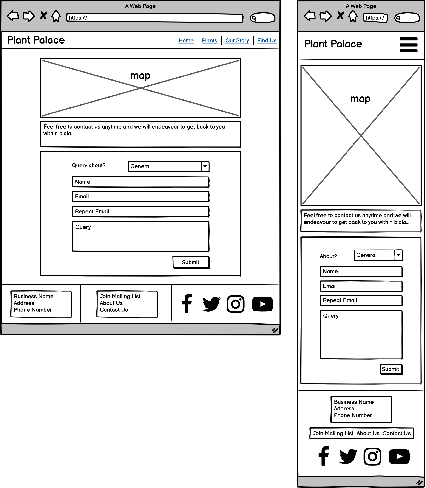

<h1 align="center">User Centric Frontend Development Milestone Project (Milestone Project #1)</h1>
<h1 align="center">Olly Lomax</h1>

<h2 align="center"></h2>

# Plant Palace Website
I made this website using my knowledge of HTML5, CSS3, jQuery and Bootstrap frameworks and UX Design which I have learned from Code Institute during my Diploma in Full Stack Software Development. The shop was made up by myself with the intention of completing my User Centric Frontend Development Milestone Project. I went slightly out of scope for the project in order to learn as much as I possibly could during the development process. From scope to testing has taken me just under 10 days.

View the live project [here](https://ollylomax.github.io/Plant-Palace---User-Centric-Frontend-Development-Milestone-Project/index.html).

The owners of Plant Palace wanted a fully responsive website with the purpose of showcasing their collection of house plants on sale, providing information and advice about the more popular species of house plants and giving a personal background on their journey and experiences. They wish to garner interest from users to both visit their local store and sign up to their mailing list.

## User Experience (UX)

-   ### User Stories

    -   #### First Time Visitor Goals

        - As a First Time Visitor I want to navigate seamlessly through the site 

        - As a First Time Visitor I want to know more about the shop and understand their journey

        - As a First Time Visitor I want to see the store in more detail to know whether I’d like to visit

        - As a First Time Visitor I want to know the store’s opening hours

        - As a First time Visitor I want to find out what plants are on sale and advice on plant upkeep

        - As a First time Visitor  I want to navigate to their social media sites so I can follow them

    -   #### Returning Visitor Goals

        - As a Returning Visitor I want to I want to be able to contact the company with a bespoke question

        - As a Returning Visitor I want to find community links

        - As a Returning Visitor I want general advice on plant upkeep

        - As a Returning Visitor I want to find out of there are any new in-store discounts/offers available

    -   #### Frequent User Goals

        - As a Frequent User I want to check to see if there are any newly added plants stocked

        - As a Frequent User I want to check to see if there is any advice on any new plants

        - As  a Frequent User I want to sign up to the mailing list so that I’m informed of any new plants on sale and/or advice given as well as any major website changes,

        - As  a Frequent User I want to sign up to the mailing list so that I’m alerted to any discounts/offers available in store.

        - As  a Frequent User I want to check back on plant maintenance after I’ve purchased in the store

-   ### Design

    - #### Colour Scheme

        
        
        

        I used three main colours for the website. A **green** for the main theme, a **dark green** for borders and smaller elements and an **off-white** for a clean contrast against both. I felt like they complimented each other well, related well to the house plant theme and provided the necessary contrast to use almost exclusively throughout the design process.

    - #### Typography

        I used two main fonts for the website, **Titillium** and **Roboto** which are both well recognised and a standard in web design.

    - #### Imagery

        I designed a simple logo with CSS styling which is present in the navigation of each page. There are an array of plant images across the site taken from [Unsplash](https://unsplash.com/) which is a free resource for stock images. They have been selected with as much uniformity as possible. There are also images relating to the journey and location of the imaginary owners, the interior and exterior of the imaginary shop as well as portrait images pertaining to fake user reviews.

-   ### Wireframes

    - Home
    
    - Plants
    
    - Our Story
    
    - Find Us
    

    The individual wireframes for each page are available in pdf format below.

    **Mobile** 
    [Plant Palace - Home](assets/wireframes/plantpalace_home-mob.pdf)

    [Plant Palace - Plants](assets/wireframes/plantpalace_plants-mob.pdf)

    [Plant Palace - Our Story](assets/wireframes/plantpalace_ourstory-mob.pdf)

    [Plant Palace - Find Us](assets/wireframes/plantpalace_findus-mob.pdf)

    **Desktop** 
    [Plant Palace - Home](assets/wireframes/plantpalace_home.pdf)

    [Plant Palace - Plants](assets/wireframes/plantpalace_plants.pdf)

    [Plant Palace - Our Story](assets/wireframes/plantpalace_ourstory.pdf)

    [Plant Palace - Find Us](assets/wireframes/plantpalace_findus.pdf)

-   ### Notable amendments to Design

    - All Pages
        - Removed footer anchors for Newsletter, About Us and Contact us on Mobile devices.
        - Modal form added to Newsletter anchor on Desktop footer.
    - Home
        - Image in second section of Home page changed to plant background picture. (Mobile and Desktop)
        - Callout form on Mobile Home Page moved to overlay hero image as per Desktop.
    - Plants
        - Image in first section of Plants page changed to shop exterior instead of interior. (Mobile and Desktop)
        - Moved Quotes section from Our Story page to below first section on Plants page. (Mobile and Desktop)
        - Added Gallery section below Plants section on Plants page. (Mobile and Desktop)
    - Our Story
        - Removed Hero image and Quotes section and replaced with Timeline section with visual timeline. (Mobile and Desktop)
    - Find Us
        - Added Opening hours section with table below Map section of Find Us page. (Mobile and Desktop)

-   ### Functional Limitations
    Having not begun JavaScript on the course yet, all form actions on the site are directed to a Code Institute form dump I used during the learning process. Therefore no data is stored from POST method on form submission.

## Features

-   ### Current
    - All pages
        - Responsive across all viewports.
        - Clear desktop navigation header with collapsable menu on mobile for space saving.
        - Newsletter anchor link on footer bringing up modal form with discount offered.
        - Contact us anchor link on footer directly linking to form position on find us page.

    - Home
        - Callout form on hero image with discount offered in store.
        - Buttons on small plants section on home page directly linking to applicable plant on plants page.

    - Plants
        - Small gallery of plants at the bottom of the plant section.
    
    - Find Us
        - Interactive google maps iframe on find us page (exact location not specified as shop is imaginary).
        - Contact form with three category headings for query submission.

-   ### Prospective
    - All pages
        - Implementation of a Live Help facility to ensure customers have as many ways possible to contact the store for advice pre or post-purchase.
    - Plants
        - Expand gallery extensively with pagination.
        - Add a search box with filters and sortation.
    - Our Story
        - Embed video/s of owners with introduction to themselves and their company.

## Technologies Used

-   ### Languages
    - [HTML5](https://en.wikipedia.org/wiki/HTML5) 
        The language used to display content and provide structure.
    - [CSS3](https://en.wikipedia.org/wiki/Cascading_Style_Sheets) 
        I used heavy custom styling on top of Bootstrap frameworks.

-   ### Frameworks, Libraries & Programs
    - [Bootstrap v4.6](https://getbootstrap.com/docs/4.6/getting-started/introduction/) 
        Framework used throughout the site to provide baseline styling and import JavaScript/jQuery.
    - [Google Fonts](https://fonts.google.com/) 
        Used to import the two fonts used throughout the website: Titillium and Roboto.
    - [Font Awesome](https://fontawesome.com/) 
        Used for icons which I added to various sections of the website including Nav, Footer and Timeline for visual aid and user experience.
    - [jQuery](https://jquery.com/) 
        Used for modal form pop-up from Newsletter anchor on footer.
    - [Git](https://git-scm.com/) 
        Used for version control to commit and push code via Gitpod to the GitHub repository where the source code is stored.
    - [Gitpod](https://www.gitpod.io/) 
        This is the IDE (Integrated Development Environment) I used to build the website and commit to Git and push to GitHub
    - [GitHub](https://github.com/) 
        GitHub is used to store the projects code after being pushed from Git and to host the deployment of the live site via GitHub Pages.
    - [Adobe Photohop](https://www.adobe.com/uk/products/photoshop.html) 
        Used to convert and resize images before uploading to local repositry.
    - [Adobe Illustrator](https://www.adobe.com/uk/products/illustrator.html) 
        Used to edit logo and export documents before uploading to local repositry.
    - [Balsamiq](https://balsamiq.com/) 
        Used during the scoping process to visualise the basic structure of the website and create wireframes during the Skeleton phase of UX Design.

-   ### Resources, Tools & Diagnostics
    - [Unsplash](https://unsplash.com/) 
        Stock photo database used as my main source of imagery throughout the website.
    - [TinyJPG](https://tinyjpg.com) 
        Used to downsample images to smaller file sizes in order to increase load times and reduce storage requirements.
    - [cloudconvert](https://cloudconvert.com) 
        Used to convert hero image for mobile to the smallest file size possible to reduce data usage on mobile devices.
    - [Favicon.io](https://favicon.io/) 
        Used in the creation of the website Favicon across all pages.
    - [Chrome DevTools](https://developer.chrome.com/docs/devtools/) 
        Used  throughout the design process to temporarily manipulate styling for debugging purposes.
    - [Safari Web Inspector](https://developer.apple.com/safari/tools/) 
        Used as above for cross-browser support.
    - [Firefox Developer Tools](https://developer.mozilla.org/en-US/docs/Tools) 
        Used as above for cross-browser support.
    - [Am I Responsive?](http://ami.responsivedesign.is/) 
        Used to create a website mock-up image across different sized devices to showcase viewport responsiveness.
    - [WAVE](https://wave.webaim.org/) 
        Used for diagnostic contrast testing.
    - [Lighthouse](https://developers.google.com/web/tools/lighthouse) 
        Used for diagnostic performance, accessibility and SEO testing.
    - [W3C Markup Validation Service](https://validator.w3.org/) 
        HTML Validator used to validate every page of the project to ensure there were no syntax errors.
    - [W3C CSS Validation Service](https://jigsaw.w3.org/css-validator/) 
        CSS Validator used to ensure there were no syntax errors in styling.

## Testing

- ### First Time Visitor Goals
    - **As a First Time Visitor I want to navigate seamlessly through the site** 
    A clear and intuitive navigation menu is present on the header in order to guide the user to and through each page of the website.

    - **As a First Time Visitor I want to know more about the shop and understand their journey** 
    A store introduction of the shop is displayed on the home page aswell as a clear navigation path to a dedicated **Our Story** page which shows the journey of the owners and shop in detail.

    - **As a First Time Visitor I want to see the store in more detail to know whether I’d like to visit** 
    The exterior of the shop is shown at the top of the **Plants** page as well as an extensive range of plants to entice the user to visit.

    - **As a First Time Visitor I want to know the store’s opening hours** 
    The opening hours are clearly tabulated and displayed on the **Find Us** page.

    - **As a First time Visitor I want to find out what plants are on sale and advice on plant upkeep** 
    An array of plants are shown on the **Plants** page with advice on upkeep. Progress bars are also displayed for aesthetics and to improve the user experience representing how much or how little each plant need sunlight and watering.

    - **As a First time Visitor  I want to navigate to their social media sites so I can follow them** 
    A full list of social media links with icons are clearly displayed on the footer which open the platforms in a new browser window.

- ### Returning Visitor Goals
    - **As a Returning Visitor I want to I want to be able to contact the company with a bespoke question** 
    
    - **As a Returning Visitor I want to find community links** 

    - **As a Returning Visitor I want general advice on plant upkeep** 

    - **As a Returning Visitor I want to find out of there are any new in-store discounts/offers available**  

